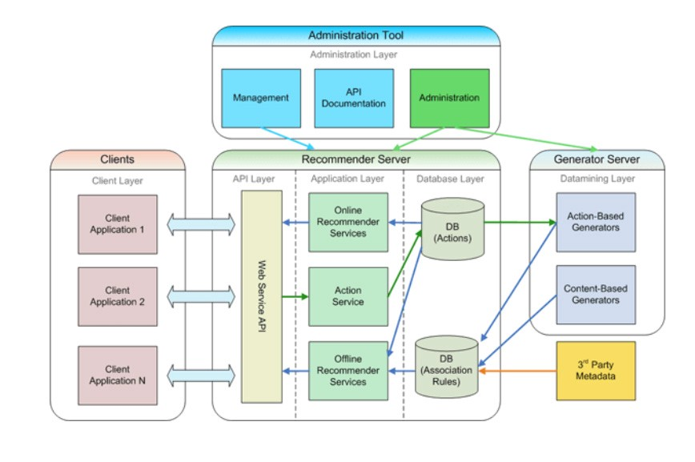

# Product One Main Page

<!-- @import "[TOC]" {cmd="toc" depthFrom=2 depthTo=6 orderedList=false} -->

<!-- code_chunk_output -->

- [Introduction](#introduction)
- [Functional Overview](#functional-overview)
- [Architecture and Systems Involved](#architecture-and-systems-involved)
- [Functional Details](#functional-details)
- [Technical Details](#technical-details)

<!-- /code_chunk_output -->

Use this page to record all the details that are relevent to product one.

Lorem ipsum dolor sit amet consectetur adipisicing elit. Velit exercitationem, dolores omnis deleniti deserunt ducimus nesciunt iure culpa facilis veniam praesentium accusantium natus quae recusandae, voluptates dolorem vitae vel dolore.

## Introduction

Lorem ipsum dolor sit amet consectetur adipisicing elit. Velit exercitationem, dolores omnis deleniti deserunt ducimus nesciunt iure culpa facilis veniam praesentium accusantium natus quae recusandae, voluptates dolorem vitae vel dolore.

## Functional Overview
Lorem ipsum dolor sit amet consectetur adipisicing elit. Velit exercitationem, dolores omnis deleniti deserunt ducimus nesciunt iure culpa facilis veniam praesentium accusantium natus quae recusandae, voluptates dolorem vitae vel dolore.

## Architecture and Systems Involved
Lorem ipsum dolor sit amet consectetur adipisicing elit. Velit exercitationem, dolores omnis deleniti deserunt ducimus nesciunt iure culpa facilis veniam praesentium accusantium natus quae recusandae, voluptates dolorem vitae vel dolore.

Lorem ipsum dolor sit amet consectetur adipisicing elit. Velit exercitationem, dolores omnis deleniti deserunt ducimus nesciunt iure culpa facilis veniam praesentium accusantium natus quae recusandae, voluptates dolorem vitae vel dolore.

There can be multiple systems involved. Each of the systems in detail can be added as separate sections.

- [**System 1**]

## Functional Details
Functional details regarding the product are available in this [area](./funcDetails/product1FuncDetails/readme.md)
## Technical Details
Technical details regarding the product are available in this [area](./techDetails/product1TechDetails/readme.md)